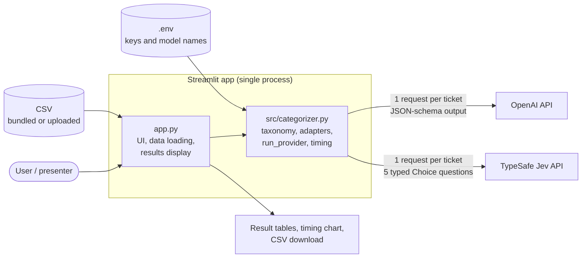
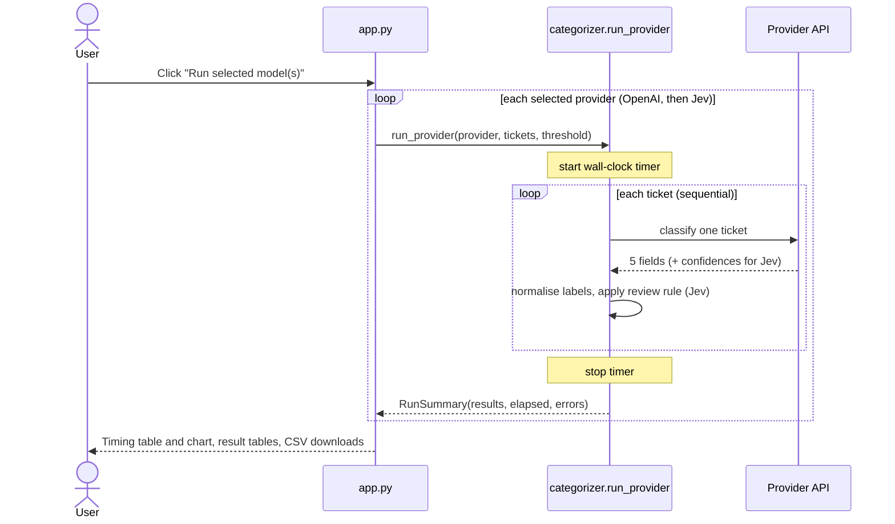

# Support Ticket Categorization: OpenAI vs. TypeSafe Jev

A Streamlit demo that classifies customer-support tickets with **OpenAI**, **TypeSafe Jev**, or **both side by side**, then compares end-to-end latency. Jev also returns a confidence score per field, which the app uses to route uncertain tickets to a human reviewer.

> **Scope:** this is a demo and evaluation harness, not a production service. It measures **speed** and shows **confidence-based routing**. It does **not** measure classification accuracy (see [Limitations](#limitations-and-what-this-demo-does-not-prove)).

## Where to start

| If you are a... | Read | Time |
| --- | --- | --- |
| **Solution architect / decision maker** | [Overview](#overview) → [Architecture](#architecture) → [Design decisions](#design-decisions) → [Comparison methodology](#comparison-methodology) → [Limitations](#limitations-and-what-this-demo-does-not-prove) → [Path to production](#path-to-production) | ~10 min |
| **Developer** | [Quick start](#quick-start) → [Configuration](#configuration) → [Code walkthrough](#code-walkthrough) → [Extending the demo](#extending-the-demo) | ~15 min |
| **Presenter running a demo** | [Quick start](#quick-start) → [Using the app](#using-the-app) → [Example results](#example-results) | ~5 min |

## Contents

1. [Overview](#overview)
2. [Architecture](#architecture)
3. [Design decisions](#design-decisions)
4. [Comparison methodology](#comparison-methodology)
5. [Quick start](#quick-start)
6. [Prerequisites and accounts](#prerequisites-and-accounts)
7. [Configuration](#configuration)
8. [Input data](#input-data)
9. [Using the app](#using-the-app)
10. [Output reference](#output-reference)
11. [Example results](#example-results)
12. [Code walkthrough](#code-walkthrough)
13. [Extending the demo](#extending-the-demo)
14. [Limitations and what this demo does not prove](#limitations-and-what-this-demo-does-not-prove)
15. [Path to production](#path-to-production)
16. [Security and privacy](#security-and-privacy)
17. [Troubleshooting](#troubleshooting)

---

## Overview

**Problem:** triage incoming IT-support tickets automatically and decide which ones can be trusted without a human.

**What the demo does:** for each ticket, it asks a model to fill in five fields. It runs OpenAI, Jev, or both, times each run, and shows the results in a table.

| Field | Possible values |
| --- | --- |
| Category | Technical Issue, Hardware Issue, Data Recovery, Needs Review / Ambiguous, Out of Scope / Unrelated |
| Device | 11 options, e.g. Laptop, Router, USB Drive, Online Account, Other / Unclear |
| Problem type | 18 options, e.g. Slow Internet Connection, Device Won't Start, Deleted Files |
| User impact | Major, Moderate, Minor, Not Applicable (unrelated requests) |
| Priority | Low, Medium, High, Not Applicable (unrelated requests) |

The complete option lists live in [`src/categorizer.py`](src/categorizer.py).

**Two ideas the demo is built to show:**

1. **Latency:** how long each provider takes for the same sequential workload.
2. **Review routing:** Jev returns a confidence score for every field. A ticket is flagged **Human Review Required** if a score is missing, invalid, or below a configurable threshold, or if its category is **Needs Review / Ambiguous**. Other successful tickets are marked **No human feedback needed**.

## Architecture

### Components



### Request flow (one run)



### Key properties

| Property | Current behaviour |
| --- | --- |
| Deployment | Single local process (`streamlit run app.py`); no server, queue, or database |
| Concurrency | None. Tickets and providers run **sequentially** |
| State | In-memory only. Nothing is persisted except CSVs the user downloads |
| External calls | HTTPS to OpenAI and/or TypeSafe, one request per ticket per provider |
| Failure handling | Per-ticket `try/except`; a failed ticket is recorded and the run continues. Missing API key stops the run with a clear message |
| Secrets | Read from environment / `.env` via `python-dotenv`; never displayed |

## Design decisions

| Decision | Rationale | Trade-off |
| --- | --- | --- |
| **One call per ticket, all five fields at once** | Fair like-for-like workload for both providers; simple to reason about | Per-field calls could improve isolation but would multiply request count and latency |
| **Sequential execution** | Deterministic, easy to time and debug; avoids rate-limit noise | Total time is much longer than a concurrent design; not representative of peak throughput |
| **OpenAI strict JSON schema with enum labels** | Guarantees the output is one of the allowed labels without post-hoc parsing | OpenAI returns no per-field confidence in this setup |
| **Jev typed `Choice` questions** | Native typed decisions plus a confidence score per field | Behaviour depends on the Jev model version (`jev-latest` can change over time) |
| **`temperature=0` for OpenAI** | Reduces run-to-run variance in labels | Does not guarantee identical output |
| **Shared taxonomy dicts, normalised by `_labels()`** | One source of truth for labels; tolerant of key/label/case variations | Prompt text for OpenAI still names the categories in prose (see [Extending](#extending-the-demo)) |
| **Threshold on every field; explicit ambiguous-category gate** | One uncertain field or a Needs Review label involves a human | May over-flag tickets where only a low-stakes field is uncertain |
| **Failures route to human review (Jev)** | Safe default; never silently auto-accept a failed call | Transient API errors inflate the review count |
| **Wall-clock timing around the whole loop** | Measures what a user would experience end to end | Includes network and service overhead, not model-only inference time |

## Comparison methodology

What is compared, and what is not:

| Aspect | Same for both? | Notes |
| --- | --- | --- |
| Tickets and order | Yes | Same dataframe, same sequence |
| Output fields and allowed values | Yes | Both draw from the same taxonomy dicts |
| Requests per ticket | Yes | One |
| Prompting | **No** | OpenAI receives a system prompt with rules (e.g. when to choose *Needs Review*, when impact/priority are *Not Applicable*). Jev receives per-question instructions plus the option list |
| Output mechanism | **No** | JSON schema (OpenAI) vs. typed Choice questions (Jev) |
| Confidence scores | **No** | Jev only |
| Models | Configurable | Defaults: `gpt-4o-mini` and `jev-latest` |

Guidance for a fair timing comparison:

- Use the same ticket count for every run, and run **at least three times**; report the average.
- Run from the same machine and network, ideally at a similar time of day.
- Treat results as a snapshot: provider load, account rate limits, and geography all affect latency.
- Report cost separately. The app does not measure token usage or spend.

## Quick start

Requires **Python 3.10+** and an API key for each provider you want to run (see [Prerequisites](#prerequisites-and-accounts)).

**macOS / Linux**

```bash
python3 -m venv .venv
source .venv/bin/activate
pip install -r requirements.txt
cp .env.example .env        # then edit .env and add your API key(s)
streamlit run app.py
```

**Windows (PowerShell)**

```powershell
py -3 -m venv .venv
.\.venv\Scripts\Activate.ps1
pip install -r requirements.txt
Copy-Item .env.example .env
notepad .env                # add your API key(s)
streamlit run app.py
```

The app opens in your browser (default `http://localhost:8501`). If a key is missing, the key status panel shows **Missing** and the run button stays disabled until it is set.

## Prerequisites and accounts

| Run mode | Account and credential required |
| --- | --- |
| OpenAI only | An OpenAI API Platform account and an API key in `OPENAI_API_KEY`. Manage keys in the [OpenAI API dashboard](https://platform.openai.com/api-keys). |
| Jev only | A TypeSafe account and an API key in `TYPESAFE_API_KEY`. Create the key in the [TypeSafe console](https://console.typesafe.ai/). |
| Compare both | Both accounts and both keys. |

- The app only requires the key for the selected run mode.
- A ChatGPT subscription does **not** include API usage; API billing is separate. See [OpenAI API billing](https://help.openai.com/en/articles/9039756-managing-billing-settings-on-the-chatgpt-web-and-api-platform) and the [TypeSafe Python SDK quickstart](https://docs.typesafe.ai/sdk/python).
- API calls may incur charges. Check your plan, usage limits, and current pricing before running a large batch.

## Configuration

Copy `.env.example` to `.env` and set the values below.

| Variable | Required for | Default | Description |
| --- | --- | --- | --- |
| `OPENAI_API_KEY` | OpenAI, Compare | none | Your OpenAI API key. |
| `OPENAI_MODEL` | OpenAI, Compare | `gpt-4o-mini` | OpenAI model ID. Must support structured outputs (JSON schema). |
| `OPENAI_BASE_URL` | optional | OpenAI default | Custom OpenAI-compatible endpoint or proxy. Leave blank for the default. |
| `TYPESAFE_API_KEY` | Jev, Compare | none | Your TypeSafe API key. |
| `TYPESAFE_MODEL` | Jev, Compare | `jev-latest` | Jev model ID. Pin a specific version for reproducible comparisons. |
| `TYPESAFE_BASE_URL` | optional | `https://api.typesafe.ai` | Custom TypeSafe API root. Leave blank for the SDK default. |

In-app settings (sidebar):

| Setting | Default | Range | Effect |
| --- | --- | --- | --- |
| Choose model run | Compare | Compare / OpenAI only / Jev only | Which providers run |
| Jev human-feedback threshold | `0.70` | 0.00 to 1.00 | Fields below this confidence flag the ticket for review; missing/invalid scores and Needs Review categories always do |
| Upload a CSV | none | `.csv` | Replaces the bundled dataset |
| Tickets to process | `30` | 1 to 500 | Caps the batch size (and API usage) |

## Input data

The input CSV must contain these two headers:

```csv
support_tick_id,support_ticket_text
```

- With no upload, the app loads `data/sample_tickets_edge_cases.csv`.
- Rows with empty ticket text are skipped; the first *N* remaining rows are processed.
- Only the ticket text is sent to the provider APIs. The ticket ID stays in local results; any other columns are ignored. Rows with an empty ID or text are skipped.

### Bundled sample: `data/sample_tickets_edge_cases.csv`

30 synthetic tickets (`STEDGE-001` to `STEDGE-030`) designed to stress-test classification. They cover all five category outcomes, Major/Moderate/Minor impact, Low/Medium/High priority, *Not Applicable* for unrelated requests, vague or conflicting descriptions, and out-of-scope requests (e.g. recipes, sports, cover letters). The file has no expected labels.

## Using the app

1. Start the app and choose a run mode in the sidebar.
2. Optionally upload a CSV, or keep the default dataset.
3. Set **Tickets to process**. Start with `3` to `5` for a quick check; use `30` for the full bundled set.
4. For Jev runs, adjust the **human-feedback threshold** if needed.
5. Click **Run selected model(s)**.
6. Review the elapsed-time table and chart, both result tables, and any red **Human Review Required** cells. Download each provider's results as CSV.

Template for recording repeated runs:

| Run | Tickets | OpenAI total (s) | OpenAI avg / ticket (s) | Jev total (s) | Jev avg / ticket (s) | Jev human reviews | Errors |
| --- | ---: | ---: | ---: | ---: | ---: | ---: | ---: |
| 1 | ___ | ___ | ___ | ___ | ___ | ___ | ___ |
| 2 | ___ | ___ | ___ | ___ | ___ | ___ | ___ |
| 3 | ___ | ___ | ___ | ___ | ___ | ___ | ___ |
| Average | ___ | ___ | ___ | ___ | ___ | ___ | ___ |

## Output reference

**Elapsed-time table** (one row per provider): provider, model, tickets, total time (s), average time per ticket (s) = total ÷ tickets, error count.

**Results CSV columns**

| Column | Providers | Description |
| --- | --- | --- |
| `support_tick_id`, `support_ticket_text` | Both | Echo of the input |
| `category`, `device`, `problem_type`, `user_impact`, `priority` | Both | Display labels from the taxonomy; empty if the call failed |
| `<field>_confidence` | Jev | Confidence (0 to 1) for each of the five fields; empty on failure |
| `minimum_confidence` | Jev | Lowest of the five confidences; empty if any is missing or invalid |
| `low_confidence_fields` | Jev | Comma-separated fields below the threshold or with missing/invalid confidence; `Model call failed` on API failure |
| `review_status` | Jev | `Human Review Required` or `No human feedback needed` |
| `error` | Both | Error message for a failed row, otherwise empty |

Downloaded files are named `openai_ticket_results.csv` and `typesafe_jev_ticket_results.csv` and are UTF-8 with BOM so they open cleanly in Excel.

## Example results

One observed run: 30 tickets, `gpt-4o-mini` vs. `jev-latest`, no errors from either provider.

| Provider | Model | Tickets | Total time (s) | Average per ticket (s) | Errors |
| --- | --- | ---: | ---: | ---: | ---: |
| OpenAI | `gpt-4o-mini` | 30 | 49.755 | 1.658 | 0 |
| TypeSafe Jev | `jev-latest` | 30 | 10.836 | 0.361 | 0 |

In this run, Jev completed about **4.59× faster** than OpenAI (49.755 s ÷ 10.836 s). This is a single observation, not a guaranteed result; timing varies with network conditions, provider load, and account configuration.


## Code walkthrough

```text
.
├── app.py                              Streamlit dashboard (UI, data loading, results display)
├── src/
│   ├── __init__.py
│   └── categorizer.py                  Label taxonomy, OpenAI and Jev adapters, timing
├── data/
│   └── sample_tickets_edge_cases.csv   30 synthetic ambiguous and unrelated test tickets
├── .env.example                        API key and model settings template
├── .gitignore                          Keeps .env, virtualenvs, and caches out of Git
├── requirements.txt                    Python dependencies
└── README.md
```

**`app.py`** handles everything user-facing: sidebar controls, CSV loading and validation, credential status, the run button, the timing table/chart, per-provider result tables with review-status colouring, and CSV downloads. It contains no provider logic.

**`src/categorizer.py`** holds all domain and provider logic:

| Symbol | Purpose |
| --- | --- |
| `CATEGORIES`, `DEVICES`, `PROBLEM_TYPES`, `IMPACTS`, `PRIORITIES` | Taxonomy: machine key → display label. Keys are the Jev choice IDs; labels are the OpenAI enum values and what the UI shows |
| `_labels(raw)` | Normalises model output (key, key with spaces/hyphens, or label, any case) to a display label; unknown values fall back to *Other / Unclear* where available |
| `_openai_client()` / `_openai_one()` | Build the client from env; classify one ticket via chat completions with a strict JSON schema |
| `_typesafe_client()` / `_jev_one()` | Build the client from env; classify one ticket via `system_one` with five `Choice` questions, then compute confidences and the review flag |
| `run_provider()` | Runs one provider over a dataframe, times the loop, collects row-level errors, reports progress |
| `RunSummary` | Dataclass: provider, model, results dataframe, elapsed seconds, errors, average per ticket |
| `compare_summaries()` | Builds the elapsed-time table |
| `ProviderError` | Actionable configuration error surfaced in the UI |

**Review rule (Jev), in pseudocode**

```text
for each field in [category, device, problem_type, user_impact, priority]:
    if confidence is missing, invalid, or confidence < threshold:
        add field to low_confidence_fields
review_status = "Human Review Required" if low_confidence_fields or category == "Needs Review / Ambiguous" else "No human feedback needed"
```

## Extending the demo

**Change the taxonomy** (add or rename a label)
1. Edit the relevant dict in `src/categorizer.py`. The key is the Jev choice ID; the value is the display label.
2. The OpenAI JSON schema is built from the same dicts, so the enum updates automatically.
3. If you change *categories* or the meaning of *Not Applicable*, also update the prose in the OpenAI `system` prompt inside `_openai_one()`; it names the categories explicitly.
4. Update the field table in this README.

**Add another provider**
1. Add a client factory and a `_<name>_one(...)` function in `src/categorizer.py` that returns the five display-label fields (use `_labels()` to normalise).
2. Add a branch for it in `run_provider()` with its display name.
3. Add the mode to the radio list and `provider_selection` in `app.py`, and add its credential check.
4. Note: the "X× faster" message in `app.py` assumes exactly two summaries in the order OpenAI, Jev. Generalise it if you add a third.

**Tune the human-review rule**
Edit `_jev_one()`. Examples: per-field thresholds or ignoring low-stakes fields. The current rule already requires review whenever `category` is *Needs Review / Ambiguous*.

**Speed up large runs**
Replace the sequential loop in `run_provider()` with a bounded thread pool or async client, and add retry with backoff for rate-limit errors. Note that doing so changes what the timing numbers mean.

## Limitations and what this demo does not prove

- **No accuracy measurement.** The app reports speed and confidence only. Without labelled ground truth, you cannot conclude which provider classifies *better*. See [Path to production](#path-to-production) for an evaluation approach.
- **Confidence is not calibrated against correctness here.** A threshold of 0.70 is a default, not a validated operating point.
- **Prompts are not identical** across providers (see [methodology](#comparison-methodology)); differences in labels can come from prompting as well as the model.
- **Sequential, single-process timing** does not represent concurrent or high-volume behaviour.
- **Latency numbers are snapshots.** They depend on network, region, provider load, and account limits.
- **Cost is not measured.** Compare provider pricing for your expected volume separately.
- **Synthetic data.** The bundled tickets are short and clean compared with real support traffic (attachments, threads, multiple languages, noise).
- **No automated tests or CI** are included.
- **`jev-latest` is a moving target.** Pin a model version when you need reproducible results.

## Path to production

For architects scoping a real deployment, these are the gaps between this demo and a production service:

| Area | Demo today | Production consideration |
| --- | --- | --- |
| **Integration** | CSV in, CSV out | Ingest from the ticketing system (webhook or queue); write labels back via its API |
| **Throughput** | Sequential, one process | Worker pool or async calls; queueing; rate-limit aware retries with backoff and idempotency |
| **Human-in-the-loop** | Red highlight in a table | A review queue with assignment, SLAs, and correction capture; use corrections as new evaluation data |
| **Threshold setting** | Fixed default | Calibrate on labelled data: choose the threshold from the trade-off between auto-handled share and error rate |
| **Evaluation** | None | Build a labelled golden set (the edge-case set is a starting point), track per-field accuracy, confusion between categories, and drift on each model/version change |
| **Model/version control** | `jev-latest`, env-configured | Pin versions, run regression evaluations before upgrades, and keep a rollback path |
| **Observability** | Row-level error list | Structured logs, latency and error metrics, token/cost tracking, alerting |
| **Security & compliance** | Local `.env` | Secrets manager, least-privilege keys, PII redaction before sending text, data-residency and retention review of both providers |
| **Resilience** | Failed rows flagged | Timeouts, circuit breakers, fallback provider or default routing when a provider is down |
| **Quality gates** | None | Unit tests for normalisation and review rules; contract tests against provider SDKs; CI |

## Security and privacy

- API keys live in your local `.env` file, which is ignored by Git. Never put real keys in source files, commits, or screenshots.
- Only the ticket text is sent to the selected provider's API; IDs stay in the local result table. Do not upload tickets containing sensitive personal data unless your provider agreements allow it.
- Results are held in memory and written to disk only when you click a download button.

## Troubleshooting

| Symptom | Likely cause and fix |
| --- | --- |
| Key shows **Missing** and the run button is disabled | The key is not set in `.env`, or the app was started before `.env` was saved. Save the file and restart `streamlit run app.py`. |
| "CSV is missing required columns" | The CSV must have `support_tick_id` and `support_ticket_text` headers. |
| "No bundled dataset found" | `data/sample_tickets_edge_cases.csv` was removed. Restore it or upload a CSV. |
| Row-level errors in the results | Expand the error panel under the results table. Failed Jev rows are automatically flagged for human review. |
| OpenAI error about `response_format` or schema | The configured model does not support structured outputs. Use a model that does. |
| Very different timings between runs | Expected; network and provider load affect wall-clock time. Average several runs. |
| `ModuleNotFoundError` | The virtual environment is not active, or `pip install -r requirements.txt` was not run. |
